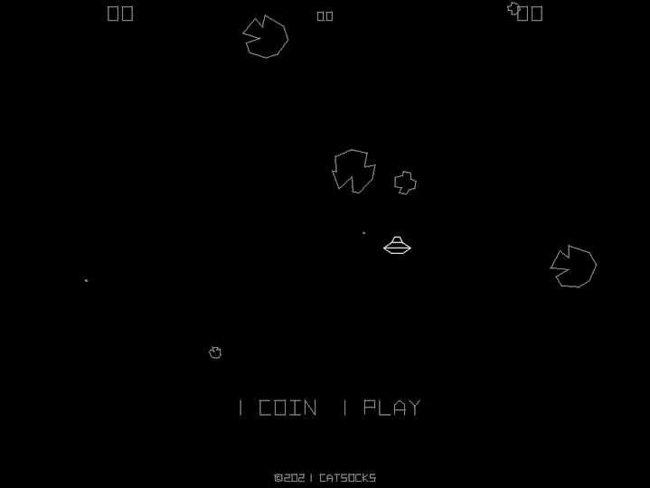

# Spacerocks

An [Asteroids](https://en.wikipedia.org/wiki/Asteroids_%28video_game%29)
arcade game clone made with the [SDL](https://www.libsdl.org/) cross-platform
multimedia library for Windows, macOS, Linux and the browser.

You can play the game in your browser [here](https://catsocks.github.io/spacerocks-sdl)
and download the game from the Releases page of the GitHub repository
[here](https://github.com/catsocks/spacerocks-sdl/releases).

I aimed to make this clone almost identical to the original game, but since my
primary motivation was to learn more about 2D game development, the game
deviates from the original in some places, such as in the appearance of the
spaceship and explosions.

You can watch a video of Asteroids on Youtube
[here](https://youtu.be/WYSupJ5r2zo) and play it with the
[MAME](https://github.com/mamedev/mame) emulator provided you have an
Asteroids ROM.

## Features

* Support for up to 2 gamepads
* Touchscreen buttons (shown after the first touch)
* Persistent high scores (saved after entering initials)
* Portuguese text (English by default)
* Resizable window and desktop fullscreen

## Screenshots



* [The start screen with the saucer and asteroids](screenshots/1-start-screen.png) (shown above)
* [Shooting asteroids in 2 player game](screenshots/2-shooting-asteroids.png)
* [Player 2 entering initials](screenshots/3-player-2-entering-initials.png)
* [Player 1 entering initials](screenshots/4-player-1-entering-initials.png)
* [The high scores screen showing two scores](screenshots/5-high-scores.png)

## Controls

### Keyboard

* <kbd>C</kbd> inserts a a coin
* <kbd>1</kbd> starts a 1 player game
* <kbd>2</kbd> starts a 2 player game
* <kbd>A</kbd> rotates the ship left
* <kbd>D</kbd> rotates the ship right
* <kbd>W</kbd> thrusts the ship forward
* <kbd>J</kbd> fires a missile
* <kbd>K</kbd> sends the ship into hyperpace
* <kbd>F11</kbd> toggles fullscreen
* <kbd>F10</kbd> switches to the next language
* <kbd>F9</kbd> switches to the previous language

The ones below are only available when the DEBUG_SPACEROCKS symbol is equal
to 1. It is set to 1 for debug builds by default in
[CMakeLists.txt](CMakeLists.txt).

* <kbd>3</kbd> adds an extra ship
* <kbd>4</kbd> adds 5,000 points
* <kbd>5</kbd> destroys the ship
* <kbd>6</kbd> destroys all the rocks
* <kbd>7</kbd> destroys the saucer
* <kbd>8</kbd> causes the game to be over

### Gamepad

The button names of a Xbox 360 controller are used.

* *_Y_* inserts a coin
* *_Left shoulder_* starts a 1 player game
* *_Right shoulder_* starts a 2 player game
* *_D-pad left_* rotates the ship left
* *_D-pad right_* rotates the ship right
* *_D-pad up_* thrusts the ship forward
* *_A_* fires a missile
* *_B_* sends the ship into hyperspace

## Build

### Requirements

#### Programs

* C compiler with C99 support
* [CMake](https://cmake.org/)
* Node.js (optional, used for building the website and the manual)

Before using the Node.js scripts make sure to install their dependencies using
the _install_ command of the npm command-line tool from the root folder of the
project.

#### Libraries

* [SDL](https://github.com/libsdl-org/SDL) >= 2.0.13
* OpenAL (preferably [OpenAL Soft](https://github.com/kcat/openal-soft)) >= 1.1 (guess)
* [PhysicsFS](https://www.icculus.org/physfs/) >= 3.0.0 (guess)

### Native executable

The game's executable can be built by first configuring a build using CMake
from the root folder of the project:

```sh
$ cmake -S . -B build -DCMAKE_BUILD_TYPE=Debug
```

The command will configure a debug build to a folder named build.

If you wouldn't like to build the tests pass `-DBUILD_TESTING=off` and if you
encounter any issues with missing libraries, passing
`-DCMAKE_FIND_DEBUG_MODE=on` will make CMake print where it expects to find
the library files.

With a successfully configured build, you can build it as follows:

```sh
$ cmake --build build
```

And with a successful build you can run the executable from the build folder
like so (assuming you're using an Unix-like shell):

```sh
$ (cd build && ./spacerocks)
```

It's necessary to run Spacerocks from the folder it was built so it may find its
assets.

#### Manual

The manual is an HTML file containing a stripped down version of the website's
index page meant to be distributed with the game's executable.

The manual can be built using the spacerocks_manual build target defined in
CMakeLists.txt which will call the
[tools/build-manual.js](tools/build-manual.js) script for you:

```sh
$ cmake --build build --target spacerocks_manual
```

### Emscripten executable

Emscripten is used to create an executable that can be run in the browser.

All the libraries listed in the requirements are used, but you will only have to
install the PhysicsFS library, because as of 2021-05-21 PhysicFS is not present
in the
[Emscripten Ports](https://emscripten.org/docs/compiling/Building-Projects.html#emscripten-ports)
collection which SDL2 will be installed from during compilation. OpenAL comes
with Emscripten so it only has to be linked.

A build is configured the same way a native build is, except the emcmake tool
should be used to call CMake, it will let CMake know how to cross-compile the
project:

```sh
$ emcmake cmake -S . -B build -DCMAKE_BUILD_TYPE=Debug
```

Build the same way you would a native executable, and with a
successful build you can run the executable using the emrun tool which will
serve it in a web server and open the server in your default browser:

```sh
$ emrun --serve_root build build/game.html
```

It's not necessary to restart emrun after rebuilding, and the option
`--no_browser` will disable the launching of the browser.

#### Website

The website for the Emscripten executable can be built using the
spacerocks_website target which will call the
[tools/build-website.js](tools/build-website.js) script for you:

```sh
$ cmake --build build --target spacerocks_website
```

If the web server used to serve the game does not compress the files it
serves, you should consider packaging the files with the Emscripten
[packager tool](https://emscripten.org/docs/porting/files/packaging_files.html#packaging-using-the-file-packager-tool)
using the `--lz4` option to enable compression since Emscripten
does not package the game assets with compression by default as of 2021-05-04.

## Bugs

* The ship thrust sound is disabled in the browser because of audio crackling
with the Emscripten OpenAL implementation

## License

My work for this project is dedicated to the public domain under the CC0 1.0
Universal license included in the [LICENSE.md](LICENSE.md) file.

The licenses of the work from third parties included in this
project is available in the [THIRD-PARTY-NOTICES.md](THIRD-PARTY-NOTICES.md)
file.

## Acknowledgements

* [MAME](https://github.com/mamedev/mame) emulator
* Section on Asteroids in the book [Game Feel](http://www.game-feel.com) by Steve Swink
* Asteroids "Operation, Maintenance and Service Manual"
* [Box2D](https://github.com/erincatto/box2d)
* [Inclusion of a Point in a Polygon](http://geomalgorithms.com/a03-_inclusion.html)
* [realfavicongenerator.net](https://realfavicongenerator.net)
* [icoconvert.com](https://icoconvert.com) for generating the Windows executable .ico
* [jsfxr](http://sfxr.me) for synthesizing the sound effects
* ['Fork me on GitHub' SVG ribbons](https://github.com/Usecue/fork-me-on-github-svg-ribbons)
